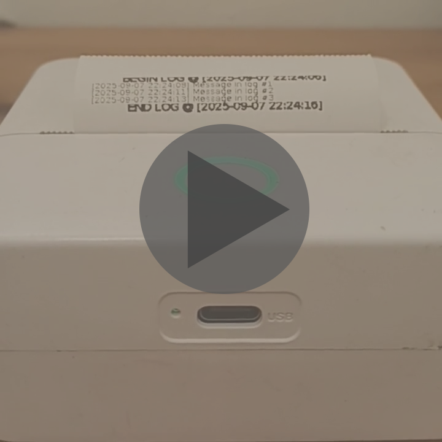

# Reverse engineering the protocol of my thermal printer
I received the Vyzio B15 as a gift around a year ago and from the beginning I
knew that I wanted to figure out how to print from my computer, as the required
app (TinyPrint) seemed weird.

Recently I came across [WerWolv's
blogpost](https://werwolv.net/blog/cat_printer) about reverse engineering his
thermal printer's protocol and I was inspired to try with my own. Furthermore, I
decided on attempting this with as little looking at their write up as possible.

## 1. Sniffing BLE traffic with ESP32
At first I attempted to just look at the data directly. Using the `nRF Connect`
app on my phone I read what BLE services and what characteristics with which
properties the printer supports. I also saw its name - "X6", which I assumed to
be the internal model name. With this information I programmed my `ESP32 C6` to
have the same name and characteristics.

I successfully managed to convince the app that my esp32 is the printer and I
printed an image to observe the traffic. I made the following observations:
1. Only one characteristic is used for communication from the app to the
printer. (uuid `0xAE01`) and it has the property `WRITE_NO_RESPONSE`. Also, the
responses are send back on `0xAE02`, which has the property `NOTIFY`.
2. The data is definitely sent in packets, beginning with `0x51 78` and ending
in `0xFF`.

## 2. Generating test images and looking at the BLE data
I wrote a python script to generate small test images:
[testGen.py](reverse_engineering/testGen.py). I took those images and recorded
their corresponding BLE traffic into text files. Then, after using this vim
macro to format them a bit better:
```
ggVGgJ:%s/5178/^V^M5178/g^MggddG:s/0*$/^M:%s/\(\w\w\)\(\w\w\)/\1 \2/g^M:%&g^M
```
, I began just staring into the captures.

After not seeing anything I recognised, I decided that each pixel was a byte in
the capture, since I had not noticed that my printer can't print grayscale and
uses dithered black and white to print. This turned out to cost me a lot of
time.
I wrote two scripts to visualise the data
([img_v1.py](reverse_engineering/img_v1.py) and
[img_v2.py](reverse_engineering/img_v2.py)), but since I expected whole bytes to
correspond to pixels, I visualised each byte's value from 0x00 to 0xFF as
brightness. 

If I had noticed that my printer prints only black and white dots, I 100% would
have tried visuallising individual bits and I would have discovered the main
protocol without even having to look at the app. But that way I wouldn't've had
such a complete understanding of the protocol.

I also wrote a script ([dataToBin.py](reverse_engineering/dataToBin.py)) that
reads the capture files into binary ones, so I could look at them in a hex
editor. I didn't find anything that way either. The funny thing is that I only
later realised that the hex editor I used, [ImHex](https://imhex.werwolv.net/)
is also made by werwolv, the originial author of the cat printer article.

## 3. Beginnings of reverse engineering the app
I gave up on looking at the captures alone and decided that I needed to take a
look at the app that I used. It is called `TinyPrint` and I only later found out
that it is by the same publisher as werwolv's `iPrint`, and their internal code
is nearly identical.

I got the application's .apk, used an online java decompiler and dove straight
into the source code. I knew that the "Print" button is on the screen where you
can preview your print and adjust settings, so I started looking for files that
contain "Preview". I found one that looked promising and began reading
`com/activity/PrintPreviewActivity.java`.

After skimming through the file and layout xml files, I found the `printBtn()`
function, which I assume is called when the button is pressed. From reading it I
got to the `printData()` function, which caused a
`this.mMyHandler.sendEmptyMessage(5)`. 

After reading a bit on the architecture of an android app, I found the handler
function `handleMessage` and ... it was not decompiled correctly. I tried a
bunch of different decompiler sites, but in the end I decided to dive into the
java pseudo-bytecode and hope it leads to another function call. The `case 5:`
eventually lead to calling the function `printBitmap`, which sent another empty
message - `4`. In the end `case 4:` in the handler lead to a call to
`com.lib.blueUtils.PrintDataUtils.BitmapToData()` function.

## 4. Distraction leading to progress for later
For some reason before continuing to the `BitmapToData` function, I decided to
focus on finding out which activityType the PrintPreviewActivity class had, and
this lead to nothing, just half a day of my live wasted.

While searching for that, I discovered the class `com.Utils.PrinterModel` and
the util class for creating the `PrinterModel`s - `com.Utils.PrintModelUtils`.
The former held every possible attribute for a printer and the latter creates a
PrinterModel instance presumably for every model, supported by the app.

In `PrinterModel` there was a big function that just assigns certain fields to
its arguments, and it was called in `PrintModelUtils` for each model. The
function looks like this:
```java
public DataBean(String str, int i, int i2, int i3, int i4, int i5, String str2,boolean z, int i6, int i7, int i8, int i9, boolean z2, int i10, int i11, int i12, int i13, int i14, int i15, boolean z3, boolean z4, boolean z5, booleanz6, String str3, int i16, int i17) {                  
    this.grayPrint = false;
    this.grayThinEneragy = 0;
    this.grayModerationEneragy = 0;
    this.grayDeepenEneragy = 0;
    this.slowInterval = 0;
    this.grayImageSpeed = 40;
    this.grayScale = 1.0d;
    this.showElectricityModel = 0;
    this.addMorPix = true;
    this.A4XII = false;
    this.tattooPaper = false;
    this.tattooSpeed = 0;
    this.tattooEnergy = 0;
    this.addMorePixNum = -1;
    this.d1key = "";
    this.useNewActivation = false;
    this.lzoVersion = "";
    this.labelDevice = false;
    this.labelDeviceSize = 0.0f;
    this.autoLabelCheck = false;
    this.corePrint = false;
    this.modelNo = str;
    this.model = i;
    this.size = i2;
    this.paperSize = i3;
    this.printSize = i4;
    this.oneLength = i5;
    this.headName = str2;
    this.canChangeMTU = z;
    this.devdpi = i6;
    this.imgPrintSpeed = i7;
    this.textPrintSpeed = i8;
    this.imgMTU = i9;
    this.newCompress = z2;
    this.paperNum = i10;
    this.interval = i11;
    this.thinEneragy = i12;
    this.moderationEneragy = i13;
    this.deepenEneragy = i14;
    this.textEneragy = i15;
    this.hasId = z3;
    this.useSPP = z4;
    this.newFormat = z5;
    this.canPrintLabel = z6;
    this.labelValue = str3;
    this.backPaperNum = i16;
    this.detectionValue = i17;
}
```
I noticed that in `PrintModelUtils` there were two printers with the name "X6" -
one was `x6` and one was `x6_n`. I mentally noted that fact and coppied the x6
function call above the DataBean function in a seperate file. Then I created
this **legendary** vim macro:
```
0f(l"ddt,xxj0f(ldw"edt,xxjvi{:s/^Re;/^Rd; \/\/ FROM FUNCTION^M?{k0
```
It takes each argument and replaces it, so I had a file with all the model's
characteristics. (See [x6_n.java](reverse_engineering/x6_n.java))

## 5. Finally in the right direction
I began reading the function `BitmapToData()` in
`com.lib.blueUtils.PrintDataUtils`. In there I discovered the command for
getting the printer's status (0x`51 78 A3 00 01 00 00 00 FF`). The function did
other things, but it lead me to `eachLinePixToCmdB()`. That method also wasn't
decompiled, but I assumed the grayscale variant `eachLinePixToCmdGray()`, which
was, would be similar, so I started reading that. After a little reading I
realised that their logic was definitely not the same so for the second time I
started reading java pseudo-bytecode line-by-line with a second vim window open
for notes about what each "variable" (register) contained at any given moment.
When in the first few lines of the function I saw the line width getting divided
by 8, I knew I was in the right place.

## 6. Discovering packets (commands)
I slowly discovered several packet types:
- enerAgy: 0x`51 78 AF 00 02 00 <energy_low> <energy_high> <crc> FF`
- printType: 0x`51 78 BE 00 01 00 <type> <crc> FF`, where the types are:
    - `0x00` for Image
    - `0x01` for Text
    - `0x02` for Tattoo (which I ignored since my printer doesn't support it)
    - `0x03` for Label
- feedPaper: `0x51 78 BD 00 01 00 <amount> <crc> FF`
- paper: `0x51 78 A1 00 02 00 <amount_low> <amount-high> <crc> FF` - this one
actually feeds the paper

Back in `BitmapToData()` I discovered:
- blackening(quality): `0x51 78 A4 00 01 00 <quality> <crc> FF`, which is always
3/5 for my printer(51, because they for some reason go from 49 to 51). Thus
`<quality> = 0x33` and `<crc> = 0x99`

Again in `eachLinePixToCmdB()` I used a couple of vim substiture commands to try
making it easier to read. You can see them in
[Appendix 1](#appendix-1-vim-commands-for-more-readable-java-pseudo-bytecode)

## 7. Simple algorithm, difficult to read
In reading the function I discovered calls to a misterious method called
`DataTrim()`. I saw that it was called with a byte from the input and an int of
some kind. Only when I noticed that it crashes for values of the byte that are
not 0 or 1 I decided that with more context I will be able to understand it and
continued onwards. 

After two entire times following the code flow through `goto`s and labels I
finally understood `eachLinePixToCmdB()`: It attempts two methods for
compressing the pixels of the line:
- Run-length encoding: Each byte's most significant bit encodes the run's value
and the 7 remaining encode the number of consecutive occurences of the value.
- Bit packing: Each byte's 8 bits each encodes one pixel seperately.

In the end you get a properly-formatted command for drawing the line, depending
on which method is shorter:  
`0x51 78 <A2 | BF> 00 dataLen 00 <data> <crc> FF`  
With the commands being the following:
- `0xA2` - bit packed pixels
- `0xBF` - run-length encoded pixels
Note that dataLen practically never requires more than 8-bits, but if it does
the 00 after it will contain the high byte.

With that I finally concluded this dreaded function.

## 8. How the app prints an image, step by step
1. Blackening: `0x51 78 A4 00 01 00 33 99 FF` - constant 51 (3/5) for my printer
2. EnerAgy: `0x51 78 AF 00 02 00 <energy_low> <energy_high> <crc> FF` - energy,
whatever that meant. This is sent only if the print type isn't `Text`.
3. PrintType: `0x51 78 BE 00 01 00 <00 | 01 | 03> <crc> FF` - Image, Text or
Label
4. FeedPaper(speed): `0x51 78 BD 00 01 00 <speed> <crc> FF` - Speed is taken
from the model's characteristics and depends on the print type. For my printer
textSpeed is `10` and imageSpeed is `30`.
5. Each line with either `0xA2` or `0xBF`. Note that which method is used is
decided on a line-by-line basis.
6. FeedPaper(25): `0x51 78 BD 00 01 00 19 4F FF` - the value is hardcoded
7. 2 x Paper(48): `0x51 78 A1 00 02 00 30 00 F9 FF` - This, as opposed to
FeedPaper, actually feeds the paper. For some reason it is called two times with
0x30, instead of one time with 0x60. Also, according to the code it this is only
for printers that don't have the field `isCanPrintLabel` set. My one does, so I
don't know why this one appears.
8. FeedPaper(25): `0x51 78 BD 00 01 00 19 4F FF` - the value is hardcoded

## 9. Decoding images from data captures
I began writing a script to decode images on Termux on my phone. I finished it
later at home and it worked! I could successfully recreate an image from
captured data. That script is [this](reverse_engineering/decode.py), but I later
adapted it to the architecture of the library, so it is more usable as a module
[here](src/decode.py).

## 10. What's left now?
I was already pretty happy with what I had achieved, but I wanted to more:
- How is the energy value determined?
- How is the print type determined?
- How is the speed determined?
- Generate commands myself (image ->\[generate\]-> commands ->\[decode\]-> same
image)
- Actually connect and send info

## 11. How the energy is determined
From the sniffed commands I knew that the energy of the printer when Print Depth
is set to 7 (the max) = 10875. In the code I discovered the following formula
for energy:  
`energy = (concentration - Code.DEFCONCENTRATION)*0.15*d + d`  
where Code.DEFCONCENTRATION = 4 and d = model.moderationEneragy. I assumed that
`concentration` is the print depth, since the `Code.DEFCONCENTRATION` = 4, which
is in the middle of 1 and 7, the bounds of the print depth. With this I had the
following equation: `10875 = (7 - 4)*0.15*d + d`, which when solved results in
`d`=`7500`. But in the model's characteristics moderationEneragy = 8000.

This is when I remembered that little note about `x6` and `x6_n` and yep...
`x6_n`'s moderationEneragy = 7500. So from this moment on I knew that my printer
was in fact a `x6_n` and updated [x6_n.java](reverse_engineering/x6_n.java)
accordingly.

In the end we have a final formula for the energy:  
`energy = (printDepth - 4)*0.15*7500 + 7500` =>  
`energy = (printDepth - 4)*1125 + 7500`

## 12. Print type and speed?
When I print an image in the app, the print type is Image or Text (depending on
selection), the speed varies accordingly (10 for text and 30 for Image), and
energy is only attached when type isn't Text.

When printing a label, it behaves exactly like Image: speed=30, energy is sent,
just printType = `0x03`. 

When printing a document, the printType could be Image or Text depending on
selection, but in both cases speed is set to 10 and energy is not sent.

## 13. Recreating the protocol in a script
After that I started trying to implement a script to generate commands for an
image file. (I don't bother with resizing or dithering, I expect an image which
is 384 pixels wide and has a bit depth of 1 bit per pixel (1bpp) ). 

My first obstacle was the crc8 checksums, which I had ignored until that point.
I looked at the algorithm and the cheksum table in
`com.lib.blueUtils.BluetoothOrder`. The algorithm seemed pretty simple, but I had one problem: One element was missing from my CHECKSUM_TABLE:
```java
private static final byte[] CHECKSUM_TABLE = {0, 7, 14, 9, 28, 27, 18, 21, 56, 63, 54, 49, 36, 35, 42, 45, 112, 119, 126, 121, 108, 107, 98, 101, 72, 79, 70, 65, 84, 83, 90, 93, -32, -25, -18, -23, -4, -5, -14, -11, -40, -33, -42, -47, -60, -61, -54, -51, -112, -105, -98, -103, -116, -117, -126, -123, -88, -81, -90, -95, -76, -77, -70, -67, -57, -64, -55, -50, -37, -36, -43, -46, -1, -8, -15, -10, -29, -28, -19, -22, -73, -80, -71, -66, -85, -84, -91, -94, -113, -120, -127, -122, -109, -108, -99, -102, 39, 32, 41, 46, 59, 60, 53, 50, 31, 24, 17, 22, 3, 4, 13, 10, 87, 80, 89, 94, 75, 76, 69, 66, 111, 104, 97, 102, 115, 116, 125, 122, -119, -114, -121, -128, -107, -110, -101, -100, -79, -74, -65, -72, -83, -86, -93, -92, -7, -2, -9, -16, -27, -30, -21, -20, -63, -58, -49, -56, -35, -38, -45, -44, 105, 110, 103, 96, 117, 114, 123, 124, 81, 86, 95, 88, 77, 74, 67, 68, 25, 30, 23, 16, 5, 2, 11, 12, 33, 38, 47, 40, Deleted59, 58, 51, 52, 78, 73, 64, 71, 82, 85, 92, 91, 118, 113, 120, 127, 106, 109, 100, 99, 62, 57, 48, 55, 34, 37, 44, 43, 6, 1, 8, 15, 26, 29, 20, 19, -82, -87, -96, -89, -78, -75, -68, -69, -106, -111, -104, -97, -118, -115, -124, -125, -34, -39, -48, -41, -62, -59, -52, -53, -26, -31, -24, -17, -6, -3, -12, -13};
```
Luckily, it was only one and since I noticed each value from 0 to 255 appeared
exactly once, it meant that if I `xor`-ed all of the other values together I
would arrive at the correct value. Later I compared the missing number with the
one in the corresponding position in werwolv's table and it matched.  
**Thank God for bitwise tricks!**

After a little more coding I had written [commands.py](src/commands.py). Now I
could successfully input an image, have it generate commands and then decode
those commands back into the original image. Or the opposite, commands to image
to commands.

## 14. Talking to the printer
After copy-pasting a bit of code from some tutorials and examples with the
library Bleak, I could send things to the printer. I decided on asking it for
its status beforehand (0x`51 78 A3 00 01 00 00 00 FF`). Until now I hadn't
looked into what the printer sends back, but after a little searching and code
following I got to `BluetoothOrder.java`'s `getDevState()` function. The
response packet contains 3 bytes of data: the first one is the device status. I
am not sure on the second and third ones, but I think they are labelNum and
battery level, whatever that means.

The logic for determining the printer's status is the following, depending on
the status byte:
```
equal to 0b00000000  -> OK
ends with 0b1        -> out of paper
ends with 0b10       -> compartment open
ends with 0b100      -> overheated
ends with 0b1000     -> low battery
ends with 0b10000    -> currently charging
ends with 0b10000000 -> currently printing
```
I decided that the only statuses I accept are OK, Low battery and Charging.
Otherwise, I refuse to send the commands. With that,
[connection.py](src/connection.py) is done!

## 15. This was a fun project indeed
In the end I could print an image from my computer, and even print text line-by-line with what is left as an example in main.py.

[](video.mp4)

## Appendix 1: Vim commands for more readable java pseudo-bytecode
TODO